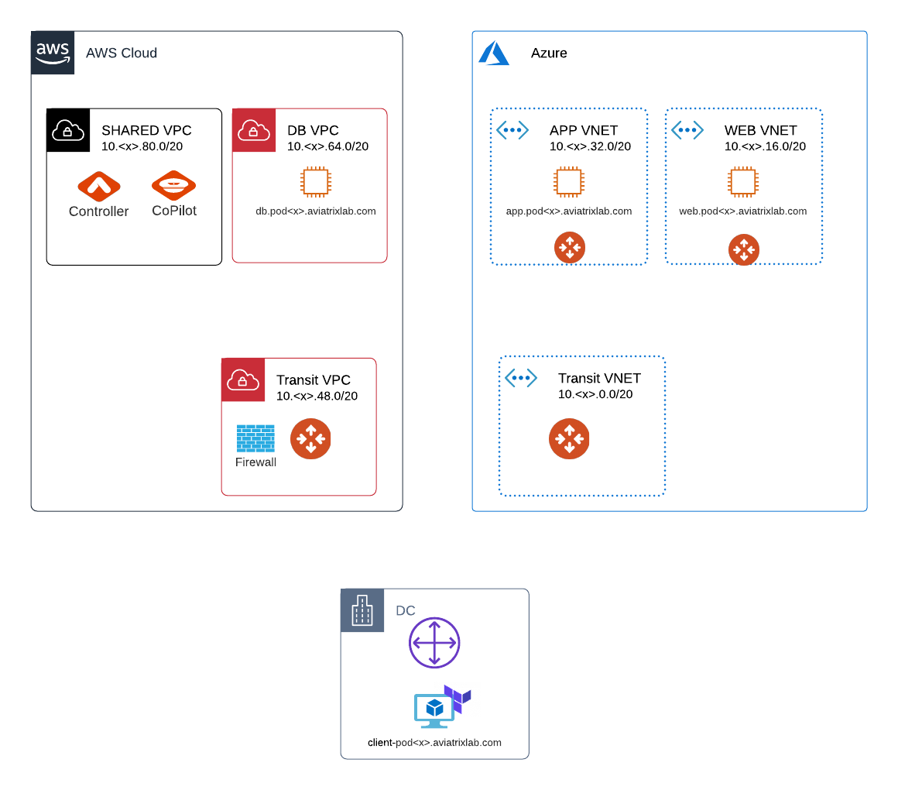

# build-workshop

### Description

This will create a lab environment for a Build Workshop.  The following will be created:

* RDP/Web VNET with a web based RDP client and a web server
* App VNET with an application server
* DB VPC with a database
* A transit VPC and transit VNET

### Diagram

### Variables
The following variables are required:

key | value
--- | ---
aviatrix_admin_password | Controller PW
aviatrix_controller_ip | Controller IP or Hostname
aws_account_number | AWS Account Number
aws_access_key | AWS Access Key for Controller account and creating EC2 instances
aws_secret_key | AWS Secret Key for Controller account and creating EC2 instances
azure_subscription_id | Azure subscription ID
azure_directory_id | Azure directory / tenant ID
azure_application_id | Azure app ID
azure_application_key | Azure app key
dns_aws_access_key | AWS Access Key for Route53 and S3
dns_aws_secret_key | AWS Secret Key for Route53 and S3
ssh_key | Client SSH key
password | Password for the instances
pod_id | Pod number

The following variables are optional:

key | default value
--- | ---
aws_region | eu-central-1
azure_region | Germany West Central
aws_account_name | AWS account name
azure_account_name | Azure account name
dns_zone | Parent zone for the lab avxlab.de