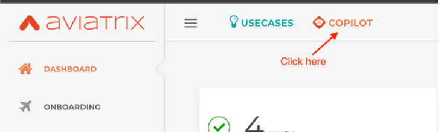
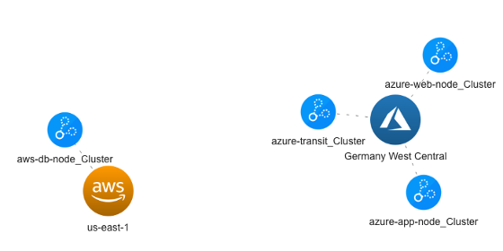
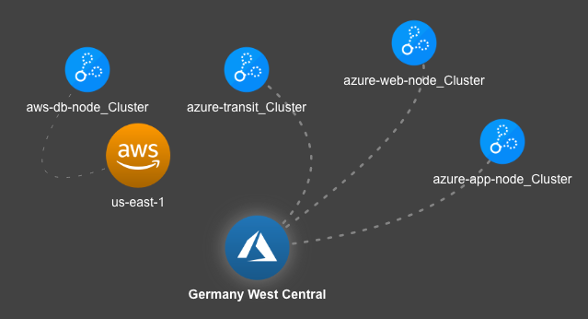

# Lab 1

## Lab Overview - What's in the lab?
Lab time: ~15 minutes

You have been tasked with building connectivity and security for an application in the cloud. It just so
happens that the different tiers of the application are spread out across different VPCs and VNETs in Azure and
AWS.  

The application components are already deployed in each of the VPCs/VNETs, all you have to do is build out
the connectivity. The app is only available via private IP address, which you can access using a web-based RDP
client, which is available on-prem


_Figure: Lab Overview_

## Lab 1.1 - Aviatrix Controller
The Aviatrix Controller is your Cloud Networking Control Plane and is deployed in a Shared Services VPC in AWS. 
### Description
Log in to the Aviatrix Controller
### Validate
Open your browser and navigate to:

**URL:** ```https://ctrl.pod[x].aviatrixlab.com```  
**Username:** ```admin```  
**Password:** ```Password123!```
### Expected Results
Explore the Dashboard. As you can see, there are already gateways deployed in different CSP environments. Do they seem connected to each other? Do you think this connection is working? Why do you think so?

## Lab 1.2 - Aviatrix Co-Pilot
Co-Pilot is your best buddy for visualizing and troubleshooting your cloud network.
### Description
Log in to Co-Pilot
### Validate
You can access CoPilot by logging into the Controller, and clicking on the CoPilot button at the top of the Window.  

  
_Figure: Copilot_  

Alternatively, you can log in directly to CoPilot using the following details:

**URL:**  ```https://cplt.pod<#>.aviatrixlab.com``` 
**Username:**  ```admin```
**Password:**  ```Password123!```

### Expected Results
You should be successfully logged into Co-Pilot.

The initial topology should look similar to the following screenshot.  Throughout the labs, refresh the Co-Pilot Topology to show the connectivity, and latency of the links.  

  
_Figure: Copilot Topology_  

## Lab 1.3 - Co-Pilot Topology Settings

### Description 
Tune the Topology Settings
### Validate
* Login into Co-Pilot and click on Topology
* From right side pane:
  * Select Physic Options:
  * Check Smooth Edges
  * Click Layout, Save Current Layout and enter a name for this Layout
* Select the Dark-Mode button  in the top right corner if you prefer Dark-Mode
* Feel free to tune the topology as you please

### Expected Results
Topology should be tuned to your preferences.

  
_Figure: Copilot Topology_  

## Lab 1.4 - Remote Access Server
To access the cloud environment, you have been provided a Remote Access Server, which conveniently offers an HTML5 based RDP experience.  
### Description
Log in to the Remote Access Server
### Validate
In order execute the connectivity tests, we need to log on to the test instances we have deployed throughout the lab. We use a web based SSH tool for this. Browse to:  

**URL:** ```https://client-pod[x].aviatrixlab.com```  
**User:** ```admin```  
**Password:** ```Password123!```  

* _(replace [x] with your pod ID)_
* _If you want to use copy/paste in this Guacamole web console, use CTRL+ALT+SHIFT on a Windows device or CTRL+CMD+SHIFT on a MacOS device._

### Expected Results
You should be able to access the RDP Client running in your “Data Center”.

## Lab 1.5 - Servers
The application tiers have been pre-deployed and are available under the following FQDNs and Ports:

```
WEB	web.pod<#>.aviatrixlab.com:80
APP	app.pod<#>.aviatrixlab.com:8080
DB	db.pod<#>.aviatrixlab.com:443
```

### Description
Test connectivity between App tiers
### Validate
Throughout the labs, using the RDP Session, open Firefox and navigate to:

```http://web.pod<#>.aviatrixlab.com```

FYI - you can also use ```http://web```

You can also try to ping the different app tiers using the Terminal icon on the Desktop of the RDP Client:
```
ping web
ping app
ping db
```
### Expected Results
The connectivity is not yet built, so none of the tests should work

## Lab 1.5 - Firewall
A Firewall has been deployed in your AWS Transit VPC and will inspect traffic to and from the AWS VPC’s.  
### Description
View the Firewall Logs
### Validate
Access the Firewall logs by navigating to:  

```http://fw.pod<#>.aviatrixlab.com```

### Expected Results
Since the connectivity is not built yet, the logs should be empty.
