# Lab 2

## Build
Lab time: ~45 minutes

Let’s go build out the connectivity for our app!

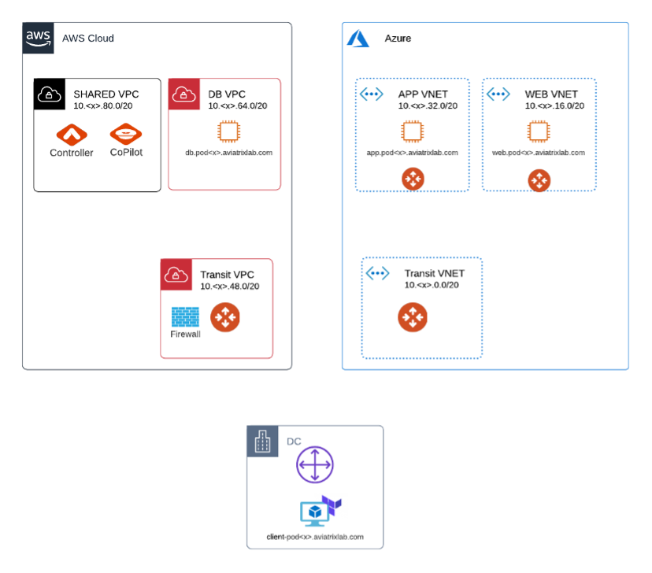
_Fig. Lab Overview_

## Lab 2.1 - Connect On-Prem to Azure
Your on-prem Network team has already configured an IPSEC tunnel from the Data Center to your Aviatrix Transit Gateway deployed in the Azure Transit VNET.  You now need to configure the tunnel from Azure to On-Prem.
### Description
Create a Site2Cloud Connection
### Validate
Log in to the Aviatrix Controller and navigate to **_Multi-Cloud Transit -> Setup --> Attach_**.  Scroll down to **_External Connection_**, select **External Device**, **BGP** and **IPSEC**.  

Enter the following fields:

|  |  |
| ------ | ----------- |
| **Transit VPC Name** | azure-transit… |
| **Connection Name** | azure-to-on-prem |
| **Aviatrix Transit Gateway BGP ASN** | 65[pod#] _For Pods 1-9, double pad the pod# with an additional 0 (ie. 65004) and for Pods 10-99 single pad (ie. 65010)_ |
| **Algorithms** | Leave unchecked to select default values |
| **BGP Remote AS Number** | 65000 |
| **Remote Gateway** | <ip-address> _Please resolve the FQDN onprem-gw.aviatrixlab.com_ |
| **Pre-shared Key** | mapleleafs |
| **Local Tunnel IP** | 169.254.[pod#].2/30 |
| **Remote Tunnel IP** | 169.254.[pod#].1/30 |

### Expected Results
After 2 minutes, you should see the tunnel come up.  Scroll down the left side menu, select Site2Cloud and select Setup  
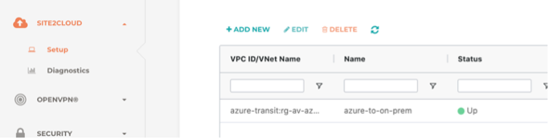  
_Fig. Site2Cloud_  

Have a look at Co-Pilot Topology as well.  Double-Click the azure-transit blue node to open it up – you should see the Site2Cloud connection being green here as well.  

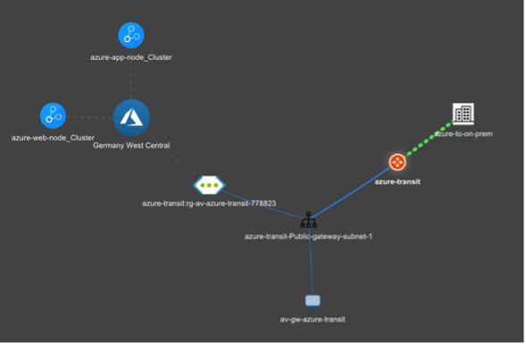  
_Fig. Topology_  

## Lab 2.2 - Approve the Learned Routes
### Description
Aviatrix allows you to filter learned routes from external sites, and the Transit GW deployed in this lab has Route Approval enabled by default.  We want to route approve _one_ of the summarized routes from on-prem.
### Validate
* Navigate to **_Multi-Cloud Transit -> Approval_** -> select the **_azure-transit_**
* From the Pending Learned CIDRs list, select the **10.0.0.0/8** route and then select the **Approve** button
* Select the **Update** button at the bottom of the page to apply the route update  

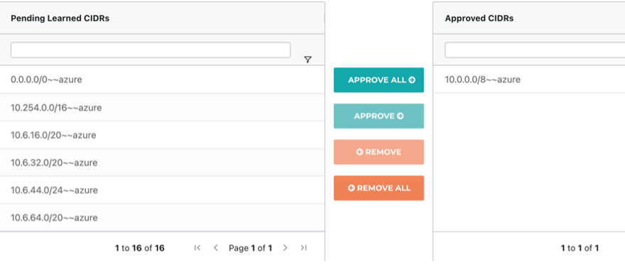  
_Fig. Route Approvals_  
  
### Expected Results
The on-prem range 10.0.0.0/8 should be learned in the cloud now.

You can verify this in **_Co-Pilot -> Cloud Routes -> BGP Info -> Learned Routes (Show)_**  

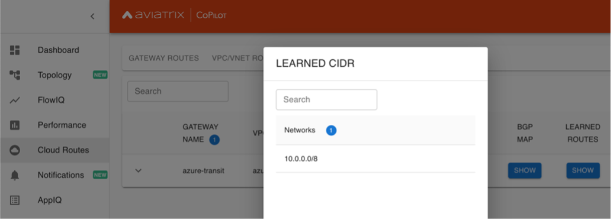  
_Fig. Copilot Routes_  

## Lab 2.3 - Deploy an Aviatrix Spoke Gateway in the DB VPC
### Description
Most of the Gateways have been pre-deployed for you, with the exception of the Transit Gateway in the AWS Transit VPC.  The Aviatrix Controller handles the deployment and lifecycle of the Aviatrix Gateways for you.  
### Validate
* Navigate to **_Multi-Cloud Transit -> Setup -> Spoke -> Launch an Aviatrix Spoke Gateway_**  

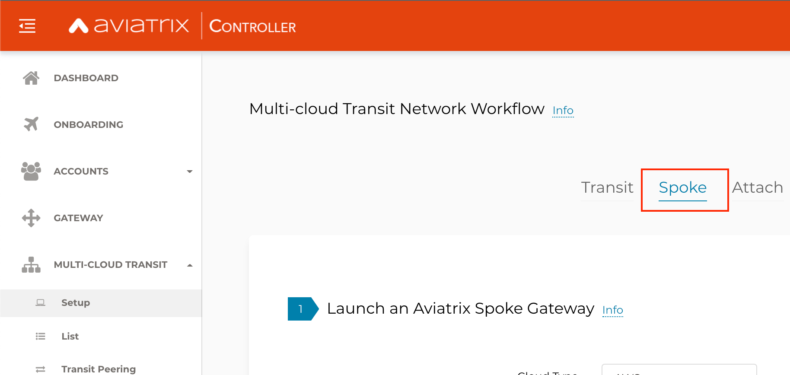  
_Fig. Screenshot_  

* Enter the following fields:

|  |  |
| ------ | ----------- |
| **Cloud Type** | AWS |
| **Gateway Name** | aws-db-node-gw |
| **Access Account** | aws-account |
| **Region** | us-east-1 |
| **VPC ID** | aws-db-node |
| **Public Subnet** | *aws-db-node-public* |
| **Gateway Size** | t3.small |

* Leave the rest of the default settings  

### Expected Results
After ~2 minutes, your new Aviatrix Spoke Gateway should be deployed and visible in Co-Pilot  

Check out CoPilot Topology.    
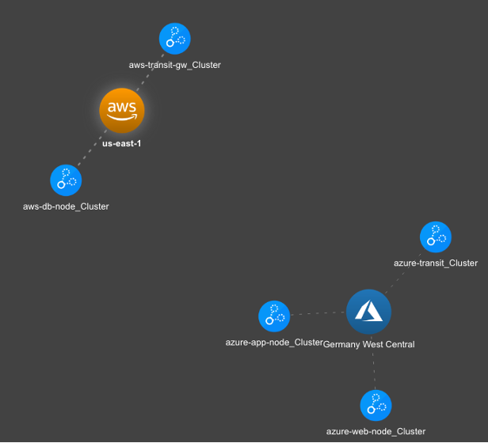  
_Fig. Copilot Topology_

## Lab 2.4 - Client / Web Connectivity
### Description
Test Connectivity to Webapp  
### Validate
* Open CoPilot -> **_Topology_**, double-click the **_azure-web-node_cluster_**.  The VNET should open up and you should see the Aviatrix Gateways
* Click the orange Aviatrix Gateway icon, then on the right side, click **_Diag_**
    * This allows you to run pings, traceroutes, test sockets, etc, directly from an AVX Gateway
    * Try to ping:
        * client-int.pod<#>.aviatrixlab.com
        * app.pod<#>.aviatrixlab.com
        * db.pod<#>.aviatrixlab.com

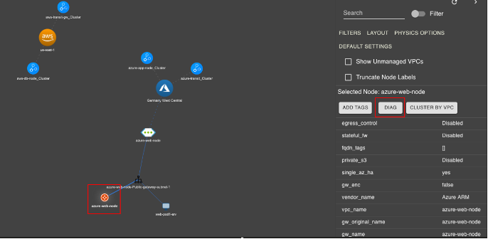  
_Fig. Topology Diag_  
### Expected Results
We have not built any connectivity yet, so none of the connectivity tests should work yet.  

## Lab 2.5 - Attaching Spokes
### Description
Attach Spoke VPCs/VNETs to their Transits
### Validate
* Open the Controller 
* Navigate to **_Multi-Cloud Transit -> Setup -> Attach -> Attach Spoke Gateway_**
* _To speed things up, feel free to open multiple browser tabs, and run a Spoke Attachment step in each tab_
* We need to do this for each of the Spokes:
    * Select _azure-web-node_ and connect it to the _azure-transit_
    * Select _azure-app-node_ and connect it to the _azure-transit_
    * Select _aws-db-node_ and connect it to the _aws-transit-gw_

### Expected Results
Each attachment should take between 30-120 seconds.  Check Co-Pilot Topology to see how the network looks after adding Gateways.  

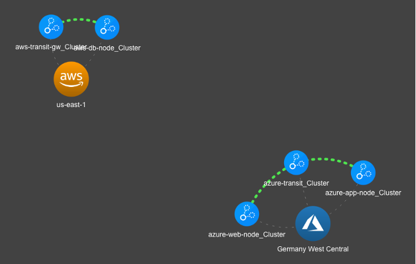  
_Fig. Topology Spokes Attached_  

## Lab 2.6 - Test the Web App
### Description
Test the Web App
### Validate
* Open the RDP Client
* Open Firefox from the Desktop on the RDP Client
* Navigate to _http://web.pod<x>.aviatrixlab.com_ or _http://web_

### Expected Results
You should see something similar to this:  
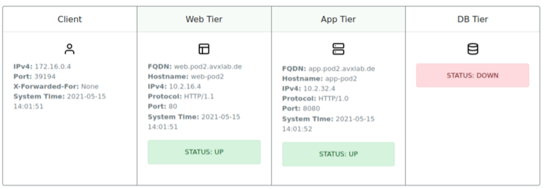  
_Fig. Webapp_

## Lab 2.7 - Co-Pilot Diagnostics
### Description
Using Co-Pilot Topology to Test Connectivity
### Validate
* Open **_Co-Pilot -> Topology_**, double-click the **_azure-web-node_cluster_** (the blue nodes represent VPCs and VNETs)
* Click on the Aviatrix Gateway icon and select **Diag** on the right side of the screen
* Try to ping:
    * client-int.pod<#>.aviatrixlab.com
    * app.pod<#>.aviatrixlab.com
    * db.pod<#>.aviatrixlab.com
* Try to traceroute:
    * client-int.pod<#>.aviatrixlab.com
    * app.pod<#>.aviatrixlab.com
    * db.pod<#>.aviatrixlab.com
* Check out the Active Sessions or try a Packet Capture

**_Huge benefit to owning the data-path in the cloud!  You have complete visibility and have the tools needed to troubleshoot and operate your network!_**  

### Expected Results
You should see something similar to this:
  
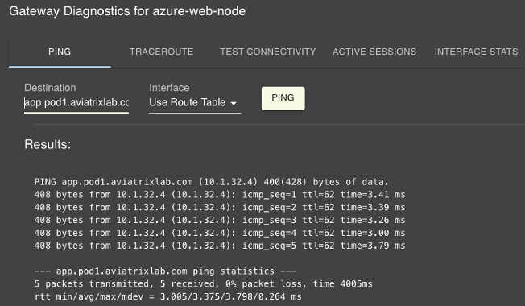  
_Fig. CoPilot Ping_

Note:
* Since there is no connectivity to AWS, the DB node should not be pingable
* Find network issues quicker with Topology!

## Lab 2.8 - FlowIQ
### Description
Using Co-Pilot FlowIQ to Debug Flows
### Validate
* Open Co-Pilot -> **_FlowIQ_** -> select the **_Records_** tab
* Under **_Edit Filters_**, click **_Add Rule_**, select **_Destination Port_** is equal to **8080** (traffic from Web to App)
* Click **_Add Rule_** again, make sure to select **_OR_**, select **_Destination Port_** is equal to **443** (traffic from App to DB)
* In the date range, select **Last Hour**, click the **Apply** blue button
* In the Records tab, you can view the raw flow logs.  Click **Edit Columns** and add the column **TCP Flag Tags** and **Destination Port** – here you should be able to see the App trying to connect to the DB tier, but we only get a **SYN**

### Expected Results
You should see something similar to this showing successful flows from Web to App, but unsuccessful from App to DB:  

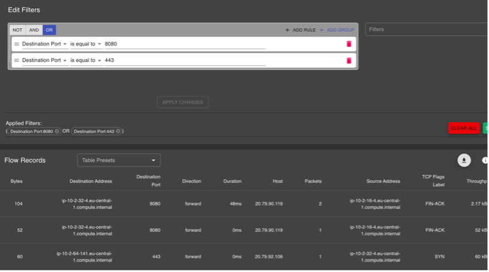  
_Fig. FlowIQ_  

Note:
* No connectivity to the DB tier means that we only see SYNs
* Use FlowIQ to get insights into all flows running over your Cloud Network

## Lab 2.9 - Co-Pilot Topology
### Description
Using Co-Pilot Topology to Visualize your MCNA
### Validate
-	Log in to Co-Pilot
-	Select **_Topology_**

### Expected Results
You should see something similar to this:
  
  
_Fig. Topology_

Note:
* Azure spokes are connected to the Azure Transit
* AWS spoke is connected to the AWS Transit
* We do not have connectivity between AWS and Azure!

**_Visualizing a network can be so helpful!_**

## Lab 2.10 - Multi-Cloud Peering
### Description
By this point we should have verified that connectivity in Azure is good, but we are missing the connectivity between Azure and AWS.  Aviatrix offers an easy, simple but powerful method for interconnecting clouds.

### Validate
* Log in to the Aviatrix Controller
* Navigate to **_Multi-Cloud Transit -> Transit Peering_**
    * Select **_Add New_**
    * Transit Gateway 1:  **aws-transit-gw**
    * Transit Gateway 2:  **azure-transit**
    * Select **OK**

### Expected Results
You should see something similar to this:  
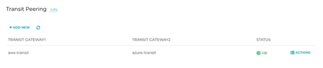  
_Fig. Transit Peering_  

Note:
-	Check Co-Pilot Topology to verify the links – you may need to refresh or wait ~30s for the Links to become green
-	Congrats!  You have now built a Multi Cloud Network!  Multi-Cloud has never been so easy ..

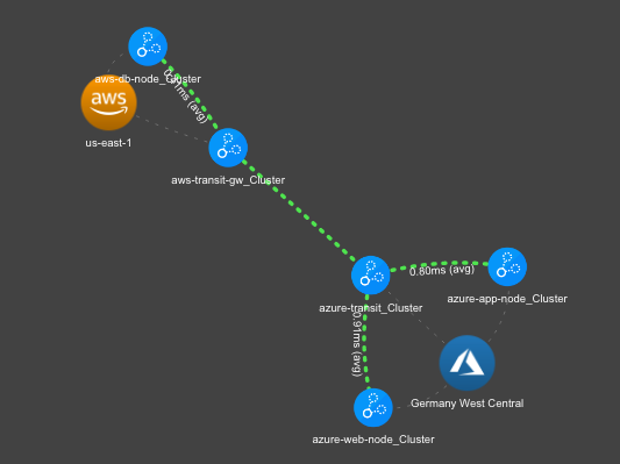  
_Fig. CoPilot Transit Peering_  

## Lab 2.11 - Test the Web App
### Description
Check whether the Web App is up and running.

### Validate
* Using the RDP session, open Firefox and navigate to:  _http://web.pod<#>.aviatrixlab.com_
* If the site is already open, click the Refresh button

### Expected Results
You should see something similar to this, meaning the Database is still not up working!
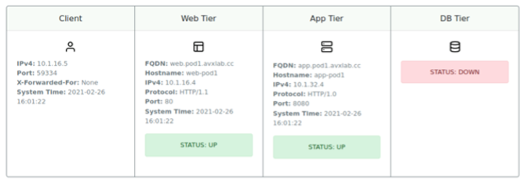  
_Fig. Webapp_  

## Lab 2.12 - Firewall Insertion
### Description
Your security team have deployed a firewall in the AWS Transit VPC.  The firewall needs to be set up to inspect East / West flows and North / South flows.

### Validate
* In the Controller, navigate to **_Firewall Network -> Setup -> Firewall -> Scroll down to step 2b -> Or, Associate Existing Firewall Instance_**
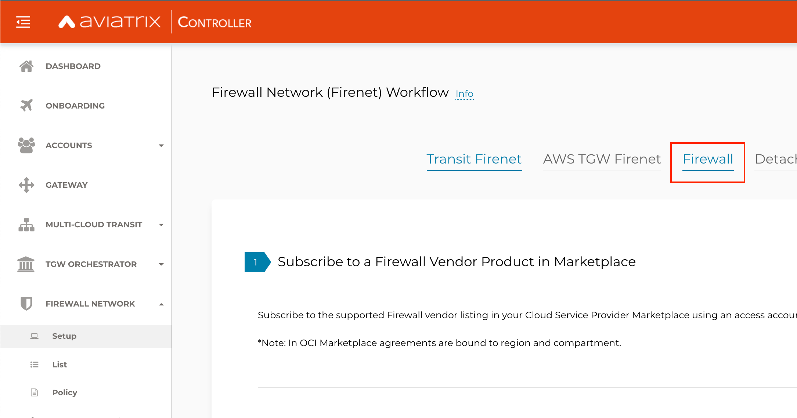  
_Fig. Screenshot_  
    * Select the AWS Transit VPC, Gateway and Firewall ID
    * LAN Interface:  select the **LAN-eni**
    * Egress Interface:  select the **WAN-eni**
    * Firewall Name:  **firewall**
    * Click **Associate**

### Expected Results
The firewall should now be associated with the firenet and Aviatrix Transit Gateway.  

## Lab 2.13 - Enable Firewall Inspection
### Description
Now that the firewall is associated with the Transit VPC, let’s make sure that East / West flows are routed over the firewall by enabling Spoke Inspection policies.
### Validate
* Navigate to **_Firewall Network -> Policy_**
    * Select the _aws-transit_ Firenet Gateway
    * Under Inspection Policies, select the _SPOKE:aws-db-node_ and select **ADD**
    * Select the _PEERING:azure-transit_ and select **ADD**

* Log in to the **Remote Access Server**, open Firefox and open the URL:  _http://web.pod<#>.aviatrixlab.com_
    * The database should still not be reachable

* Open the **Firewall Logs** and see whether the web application traffic is now being routed over the Firewall
    * http://fw.pod<#>.aviatrixlab.com

### Expected Results
You should see entries like the screenshot below.  The App Server is querying the Database on Port 443 which is being allowed.  
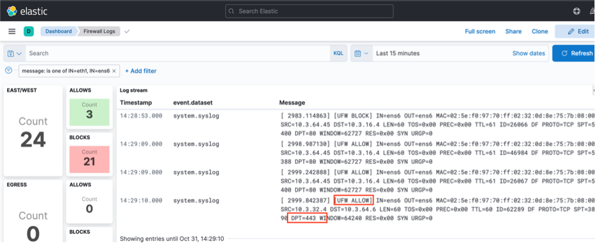  
_Fig. FW Logs_  

## Lab 2.14 - Enable Egress via the Firewall
### Description
The database is a proxy to AWS DynamoDB.  Since the database is running in a Private Subnet, without a default route, it cannot not reach DynamoDB.  Let’s make sure that Egress flows are routed over the firewall.

### Validate
* Navigate to **_Firewall Network -> List -> select the Firenet and click on Details_** 
    * Under _Egress through Firewall_ select **ENABLE**

### Expected Results
* That was easy!  A default route should be added to the private subnets in the DB Node pointing to the Aviatrix spoke gateway as the next hop.
* To verify the routes navigate to **_Multi-Cloud Transit -> List_** -> at the top on the right side, select **Spoke**
* Select the _aws-db-node-gw_ and click **Details/Diag**
* Scroll down and click the refresh icon beside **VPC Route Table Details**
* Scroll down to view the private subnet route tables.  You should see a route for 0.0.0.0/0 with the next hop being the Aviatrix DB Node GW

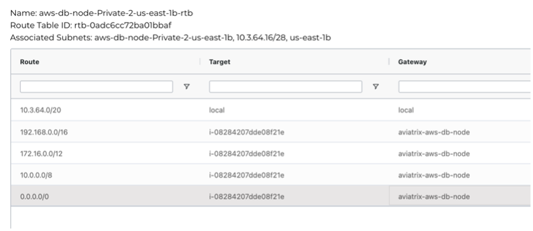  
_Fig. Default Route Spoke_  

## Lab 2.15 - Sign-in to the Web App
### Description
Now that we have built the connectivity, our Web App should be up and running.  Let's sign in to the WALL OF FAME

### Validate
* Log in to the Remote Access Server
* Open Firefox on the Desktop and navigate to: _http://web_ or _http://web.pod<#>.aviatrixlab.com_
* Click **Sign In**, enter something fancy in the **Comments** and click Sub**mit

### Expected Results
You should see that all 3 App Tiers are now up and can talk to each other.  You should also be able to *Sign In* to the **Wall of Fame**, and also be able to view the **Wall of Fame**!  

Nice work!  

Feel free to look at the **Firewall logs**, and you should see the egress traffic flows:

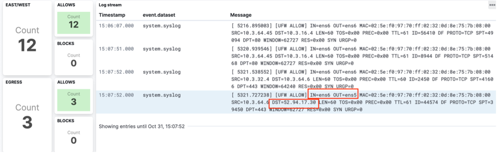  
_Fig. FW Egress Logs_  

