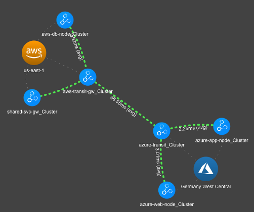

# Lab 3

## Build
Lab time: ~10 minutes

Let's add private connectivity to the Controller and CoPilot!

## Lab 3.1 - Bonus:  Build Connectivity to Shared Services
### Description
Deploy Aviatrix Spoke Gateway in the Shared Services VPC.

### Validate
* Navigate to **_Multi-Cloud Transit -> Setup -> Spoke -> Launch an Aviatrix Spoke Gateway_**  

  
_Fig. Screenshot_  

* Enter the following fields:

|  |  |
| ------ | ----------- |
| **Cloud Type** | AWS |
| **Gateway Name** | shared-svc-gw |
| **Access Account** | aws-account |
| **Region** | us-east-1 |
| **VPC ID** | shared-aws |
| **Gateway Size** | t3.small |

* Leave the rest of the default settings  

### Expected Results
After ~90 seconds, the newly created Aviatrix Spoke Gateway should be deployed and visible in CoPilot

## Lab 3.2 - Bonus:  Spoke Attachment
### Description
Attach the Shared Services Spoke to the Transit

### Validate
* Log in to the Aviatrix Controller
* Navigate to **_Multi-Cloud Transit -> Setup -> Attach -> Attach Spoke Gateway_**
* Select the following fields and attach:
    * Spoke Gateway: _shared-svc-gw_
    * Transit Gateway: _aws-transit-gw_  

### Expected Results
The Shared Service VPC should be attached to the Transit Network.  You should be able to access the Controller and Co-Pilot using the _RDP client_ (not your laptop), and these private IPs/FQDNs now:

* https://ctrl-priv.pod<#>.aviatrixlab.com
* https://cplt-priv.pod<#>.aviatrixlab.com

Co-Pilot Topology should show the following:

  
_Fig. Copilot Complete_  