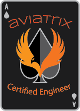

# Summary  

Congratulations!  In this short lab, you managed to:

* build out connectivity within Azure
* connectivity within AWS
* connectivity between AWS and Azure
* troubleshoot application traffic issues
* firewall inspection for East/West flows
* firewall inspection for North/South flows

  
_Fig. Lab Complete_  

And the best part is that we did not have to touch a single Route Table entry!  The secret to the simplicity is to have a central and abstracted Control Plane and robust Transit Layer, which enables you to easily build everything else on top of that.    

If you have not done so already, visit the following link to register for the [ACE Associates Certification](https://aviatrix.teachable.com/) program.  Using the voucher ACEMULTICLOUD, you can waive the ACE Associates Course and Exam cost of $1079.  Upon successful completion you will become ACE Associates certified and can then participate in the following additional ACE Courses:

* [ACE Operations](https://aviatrix.com/ace/)
* [ACE Infrastructure as Code](https://aviatrix.com/ace/)
* [ACE Professional](https://aviatrix.com/ace/)

 